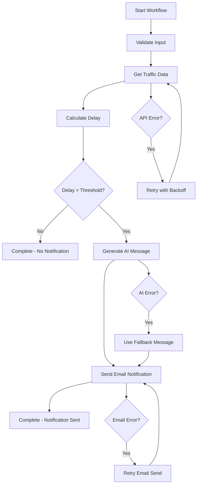

# Freight Delay Monitor - Technical Documentation

## Table of Contents

1. [Architecture Overview](#architecture-overview)
2. [Business Logic](#business-logic)
3. [API Integrations](#api-integrations)
4. [Configuration Parameters](#configuration-parameters)
5. [Workflow Execution](#workflow-execution)
6. [Error Handling](#error-handling)
7. [Performance Considerations](#performance-considerations)
8. [Monitoring and Logging](#monitoring-and-logging)
9. [Testing Strategy](#testing-strategy)
10. [Deployment Guide](#deployment-guide)

## Architecture Overview

### System Components

The Freight Delay Monitor is built using a microservices architecture with Temporal workflows orchestrating the entire process:

```
┌─────────────────┐    ┌──────────────────┐    ┌─────────────────┐
│   Client API    │    │  Temporal Server │    │  Worker Process │
│                 │    │                  │    │                 │
│ - REST endpoints│◄──►│ - Workflow engine│◄──►│ - Activity exec │
│ - CLI interface │    │ - State mgmt     │    │ - API calls     │
│ - Monitoring    │    │ - Retry policies │    │ - Error handling│
└─────────────────┘    └──────────────────┘    └─────────────────┘
         │                        │                        │
         ▼                        ▼                        ▼
┌─────────────────┐    ┌──────────────────┐    ┌─────────────────┐
│  External APIs  │    │   Data Storage   │    │    Logging      │
│                 │    │                  │    │                 │
│ - Google Maps   │    │ - Workflow state │    │ - Structured    │
│ - OpenAI        │    │ - Execution logs │    │ - Metrics       │
│ - SendGrid      │    │ - Metrics data   │    │ - Monitoring    │
└─────────────────┘    └──────────────────┘    └─────────────────┘
```

### Key Design Principles

1. **Fault Tolerance**: Temporal workflows provide automatic retries and state recovery
2. **Observability**: Comprehensive logging and metrics collection at every step
3. **Scalability**: Horizontal scaling through Temporal worker pools
4. **Modularity**: Each API integration is a separate activity for maintainability
5. **Type Safety**: Full TypeScript implementation with strict type checking

## Business Logic

### Delay Detection Algorithm

The core business logic revolves around detecting significant delays in delivery routes:

```typescript
/**
 * Delay Detection Process:
 * 1. Fetch current traffic data from Google Maps
 * 2. Compare against baseline travel time
 * 3. Calculate delay in minutes
 * 4. Check if delay exceeds configured threshold
 * 5. Generate notification if threshold is exceeded
 */

function calculateDelay(currentTime: number, baselineTime: number): number {
  return Math.max(0, currentTime - baselineTime);
}

function exceedsThreshold(delay: number, threshold: number): boolean {
  return delay > threshold;
}
```

### Threshold Configuration

Different delivery types require different delay thresholds:

- **Express Delivery**: 10 minutes (immediate notification)
- **Priority Delivery**: 15 minutes (high-priority customers)
- **Standard Delivery**: 30 minutes (regular customers)
- **Bulk Delivery**: 60-90 minutes (non-urgent shipments)

### Message Generation Logic

The AI message generation follows a structured approach:

1. **Context Building**: Include route details, delay amount, and customer information
2. **Tone Setting**: Professional, empathetic, and solution-oriented
3. **Personalization**: Customer-specific details and delivery context
4. **Fallback Strategy**: Pre-defined templates when AI generation fails

## API Integrations

### Google Maps Distance Matrix API

**Purpose**: Retrieve real-time traffic data and travel times

**Configuration Parameters**:
```typescript
interface GoogleMapsConfig {
  apiKey: string;           // Required: API authentication key
  baseUrl: string;          // API endpoint URL
  trafficModel: string;     // 'best_guess' | 'pessimistic' | 'optimistic'
  departureTime: string;    // 'now' for current conditions
  units: string;           // 'metric' | 'imperial'
  timeout: number;         // Request timeout in milliseconds
}
```

**Request Parameters**:
- `origins`: Starting location (address or coordinates)
- `destinations`: End location (address or coordinates)
- `departure_time`: Set to 'now' for current traffic conditions
- `traffic_model`: Use 'best_guess' for most accurate estimates
- `units`: Use 'metric' for consistent time calculations

**Response Processing**:
```typescript
interface GoogleMapsResponse {
  status: string;                    // 'OK' | 'INVALID_REQUEST' | etc.
  rows: Array<{
    elements: Array<{
      status: string;                // 'OK' | 'NOT_FOUND' | etc.
      duration_in_traffic: {         // Current travel time with traffic
        value: number;               // Time in seconds
        text: string;                // Human-readable format
      };
      duration: {                    // Normal travel time without traffic
        value: number;
        text: string;
      };
      distance: {                    // Route distance
        value: number;               // Distance in meters
        text: string;
      };
    }>;
  }>;
}
```

### OpenAI Chat Completions API

**Purpose**: Generate personalized delay notification messages

**Configuration Parameters**:
```typescript
interface OpenAIConfig {
  apiKey: string;           // Required: API authentication key
  model: string;            // 'gpt-4o-mini' for cost-effective generation
  maxTokens: number;        // Maximum response length (300 recommended)
  temperature: number;      // Creativity level (0.7 for balanced output)
  timeout: number;          // Request timeout in milliseconds
}
```

**Prompt Engineering**:
The system uses a structured prompt template:

```typescript
const promptTemplate = `
You are a helpful customer service representative writing delivery delay notifications.

Customer Details:
- Customer ID: {customerId}
- Route: {origin} to {destination}
- Delay: {delayMinutes} minutes

Requirements:
- Friendly and professional tone
- Acknowledge inconvenience and apologize
- Provide specific delay information
- Reassure customer about resolution efforts
- Keep message concise (100-200 words)
- No placeholder text or generic names

Write a complete email message:
`;
```

**Response Validation**:
- Minimum length: 50 characters
- Maximum length: 1000 characters
- Must mention delay amount
- Should include apologetic language
- Professional tone indicators required

### SendGrid Email API

**Purpose**: Deliver delay notifications via email

**Configuration Parameters**:
```typescript
interface SendGridConfig {
  apiKey: string;           // Required: API authentication key
  fromEmail: string;        // Sender email address (must be verified)
  fromName: string;         // Sender display name
  timeout: number;          // Request timeout in milliseconds
}
```

**Email Template Structure**:
```typescript
interface EmailTemplate {
  to: {
    email: string;          // Recipient email address
    name: string;           // Recipient display name
  };
  from: {
    email: string;          // Sender email (verified domain)
    name: string;           // Sender display name
  };
  subject: string;          // Email subject line
  html: string;            // HTML email content
  text: string;            // Plain text fallback
}
```

## Configuration Parameters

### Environment Variables

**Required Variables**:
```bash
# API Authentication
GOOGLE_MAPS_API_KEY=your_google_maps_api_key
OPENAI_API_KEY=your_openai_api_key
SENDGRID_API_KEY=your_sendgrid_api_key

# Email Configuration
FROM_EMAIL=noreply@yourcompany.com
FROM_NAME="Your Company Delivery Team"

# Temporal Configuration
TEMPORAL_SERVER_URL=localhost:7233
TEMPORAL_NAMESPACE=default

# Application Settings
DELAY_THRESHOLD_MINUTES=30
LOG_LEVEL=info
```

**Optional Variables**:
```bash
# Advanced Configuration
WORKFLOW_EXECUTION_TIMEOUT_MS=600000
WORKFLOW_RUN_TIMEOUT_MS=300000
ACTIVITY_TIMEOUT_MS=60000
API_TIMEOUT_MS=10000
MAX_CONCURRENT_ACTIVITIES=10
MAX_CONCURRENT_WORKFLOWS=5
```

### Workflow Configuration

**WorkflowConfig Interface**:
```typescript
interface WorkflowConfig {
  delayThresholdMinutes: number;    // Minimum delay to trigger notification
  retryAttempts: number;            // Maximum retry attempts for activities
  fallbackMessage: string;          // Default message when AI fails
}
```

**Parameter Guidelines**:

- **delayThresholdMinutes**: 
  - Express: 5-10 minutes
  - Priority: 10-20 minutes
  - Standard: 20-40 minutes
  - Bulk: 60+ minutes

- **retryAttempts**:
  - Critical operations: 5-6 attempts
  - Standard operations: 3-4 attempts
  - Non-critical: 1-2 attempts

- **fallbackMessage**:
  - Must include `{delayMinutes}` placeholder
  - Should be professional and apologetic
  - Include contact information if needed

### Route Configuration

**DeliveryRoute Interface**:
```typescript
interface DeliveryRoute {
  routeId: string;              // Unique identifier for tracking
  origin: string;               // Starting address or coordinates
  destination: string;          // Ending address or coordinates
  baselineTimeMinutes: number;  // Expected travel time under normal conditions
}
```

**Best Practices**:
- Use specific addresses rather than city names
- Include postal codes for accuracy
- Set realistic baseline times based on historical data
- Consider time-of-day variations in baseline calculations

## Workflow Execution

### Execution Flow



### Activity Retry Policies

**Traffic Monitoring Activity**:
```typescript
const trafficRetryPolicy = {
  initialInterval: '2s',
  backoffCoefficient: 2.0,
  maximumInterval: '30s',
  maximumAttempts: 5,
  nonRetryableErrorTypes: ['AuthenticationError', 'InvalidRouteError']
};
```

**Message Generation Activity**:
```typescript
const messageRetryPolicy = {
  initialInterval: '3s',
  backoffCoefficient: 2.0,
  maximumInterval: '60s',
  maximumAttempts: 4,
  nonRetryableErrorTypes: ['AuthenticationError', 'QuotaExceededError']
};
```

**Notification Activity**:
```typescript
const notificationRetryPolicy = {
  initialInterval: '5s',
  backoffCoefficient: 2.0,
  maximumInterval: '120s',
  maximumAttempts: 6,
  nonRetryableErrorTypes: ['AuthenticationError', 'InvalidEmailError']
};
```

### Timeout Configuration

**Activity Timeouts**:
- Traffic Monitoring: 60 seconds (API call + processing)
- Delay Analysis: 30 seconds (computational task)
- Message Generation: 90 seconds (AI API call)
- Email Notification: 120 seconds (email delivery)

**Workflow Timeouts**:
- Execution Timeout: 10 minutes (total workflow duration)
- Run Timeout: 5 minutes (single workflow run)
- Task Timeout: 30 seconds (individual task processing)

## Error Handling

### Error Categories

**Retryable Errors**:
- Network timeouts and connection issues
- Rate limiting (HTTP 429)
- Server errors (HTTP 5xx)
- Temporary service unavailability

**Non-Retryable Errors**:
- Authentication failures (HTTP 401, 403)
- Invalid input data (HTTP 400)
- Resource not found (HTTP 404)
- Quota exceeded (permanent)

**Fallback Strategies**:

1. **Traffic Data Failure**:
   ```typescript
   // Use baseline time + buffer for delay calculation
   const estimatedDelay = Math.max(0, (baselineTime * 1.2) - baselineTime);
   ```

2. **AI Message Failure**:
   ```typescript
   // Use pre-configured fallback message template
   const fallbackMessage = config.fallbackMessage
     .replace('{delayMinutes}', delayMinutes.toString())
     .replace('{origin}', route.origin)
     .replace('{destination}', route.destination);
   ```

3. **Email Delivery Failure**:
   ```typescript
   // Log failure and attempt alternative notification methods
   logger.error('Email delivery failed after all retries', { customerId, attempts });
   // Could integrate SMS, push notifications, etc.
   ```

### Error Monitoring

**Key Metrics to Monitor**:
- API failure rates by provider
- Retry attempt distributions
- Workflow completion rates
- Average execution times
- Error type frequencies

**Alerting Thresholds**:
- API failure rate > 5%
- Workflow failure rate > 2%
- Average execution time > 2 minutes
- Retry rate > 10%

## Performance Considerations

### Optimization Strategies

**API Call Optimization**:
- Connection pooling for HTTP requests
- Request batching where possible
- Caching of static data (route baselines)
- Parallel execution of independent operations

**Memory Management**:
- Streaming large responses
- Garbage collection optimization
- Memory leak monitoring
- Resource cleanup in error scenarios

**Scalability Patterns**:
- Horizontal worker scaling
- Load balancing across workers
- Database connection pooling
- Rate limiting and throttling

### Performance Metrics

**Target Performance**:
- Workflow completion: < 30 seconds (95th percentile)
- API response time: < 5 seconds (average)
- Memory usage: < 512MB per worker
- CPU utilization: < 70% under normal load

**Monitoring Points**:
```typescript
// Example performance logging
logger.apiCall('GoogleMaps', duration, success, statusCode, {
  routeId,
  responseSize: response.data.length,
  cacheHit: false
});

logger.workflowStep('DelayAnalysis', 2, duration, success, {
  delayMinutes,
  thresholdExceeded: delay > threshold
});
```

## Monitoring and Logging

### Structured Logging

**Log Levels**:
- **DEBUG**: Detailed execution information (development only)
- **INFO**: General workflow progress and results
- **WARN**: Non-critical issues and fallback usage
- **ERROR**: Errors requiring attention
- **FATAL**: Critical system failures

**Log Format**:
```json
{
  "timestamp": "2024-01-15T10:30:00.000Z",
  "level": "INFO",
  "component": "TrafficMonitoring",
  "message": "Traffic data retrieved successfully",
  "metadata": {
    "routeId": "ROUTE-001",
    "currentTravelTime": 65,
    "delayMinutes": 20,
    "trafficConditions": "Moderate traffic delays",
    "apiResponseTime": 1250
  }
}
```

### Metrics Collection

**Business Metrics**:
- Total workflows executed
- Delays detected vs. total routes
- Notifications sent vs. delays detected
- Average delay duration
- Customer notification response rates

**Technical Metrics**:
- API response times by provider
- Workflow execution duration
- Error rates by component
- Resource utilization (CPU, memory)
- Temporal queue depths

**Custom Metrics**:
```typescript
// Example metrics collection
const metrics = {
  workflow_executions_total: counter,
  workflow_duration_seconds: histogram,
  api_requests_total: counter,
  api_request_duration_seconds: histogram,
  delays_detected_total: counter,
  notifications_sent_total: counter
};
```

## Testing Strategy

### Test Categories

**Unit Tests**:
- Individual activity functions
- Data validation and transformation
- Error handling scenarios
- Configuration loading

**Integration Tests**:
- API integrations with test credentials
- Database operations
- External service interactions
- End-to-end workflow execution

**Temporal Tests**:
- Workflow logic with mocked activities
- Activity retry behavior
- Time-based workflow features
- Workflow versioning and migration

### Test Data Management

**Sample Data Sets**:
```typescript
// Test routes covering various scenarios
const testRoutes = [
  { routeId: 'SHORT', baselineTimeMinutes: 15 },    // Short urban route
  { routeId: 'MEDIUM', baselineTimeMinutes: 45 },   // Medium suburban route
  { routeId: 'LONG', baselineTimeMinutes: 120 },    // Long highway route
  { routeId: 'COMPLEX', baselineTimeMinutes: 90 }   // Complex multi-stop route
];

// Test configurations for different scenarios
const testConfigs = {
  sensitive: { delayThresholdMinutes: 10 },
  standard: { delayThresholdMinutes: 30 },
  relaxed: { delayThresholdMinutes: 60 }
};
```

**Mock Strategies**:
- API response mocking for consistent testing
- Time manipulation for workflow testing
- Error injection for resilience testing
- Load testing with concurrent workflows

## Deployment Guide

### Infrastructure Requirements

**Minimum Requirements**:
- Node.js 18+ runtime
- 2GB RAM per worker instance
- 1 CPU core per worker
- Temporal Server (local or cloud)
- Network access to external APIs

**Recommended Production Setup**:
- 3+ worker instances for high availability
- Load balancer for worker distribution
- Monitoring and alerting system
- Log aggregation and analysis
- Backup and disaster recovery

### Environment Setup

**Development Environment**:
```bash
# Install dependencies
npm install

# Set up environment variables
cp .env.example .env
# Edit .env with your API keys

# Start Temporal server
temporal server start-dev

# Start worker
npm run worker

# Run examples
npm run examples
```

**Production Environment**:
```bash
# Build application
npm run build

# Start worker with PM2
pm2 start dist/worker.js --name freight-delay-worker

# Monitor logs
pm2 logs freight-delay-worker

# Monitor metrics
pm2 monit
```

### Configuration Management

**Environment-Specific Configs**:
```typescript
// config/environments/production.ts
export const productionConfig = {
  temporalServerUrl: 'temporal.production.com:7233',
  logLevel: 'info',
  maxConcurrentActivities: 50,
  enableMetrics: true,
  enableDebugLogging: false
};

// config/environments/staging.ts
export const stagingConfig = {
  temporalServerUrl: 'temporal.staging.com:7233',
  logLevel: 'debug',
  maxConcurrentActivities: 10,
  enableMetrics: true,
  enableDebugLogging: true
};
```

### Health Checks

**Worker Health Check**:
```typescript
// Health check endpoint
app.get('/health', (req, res) => {
  const health = {
    status: 'healthy',
    timestamp: new Date().toISOString(),
    uptime: process.uptime(),
    memory: process.memoryUsage(),
    temporal: {
      connected: worker?.isRunning() || false,
      taskQueue: config.taskQueue
    },
    apis: {
      googleMaps: await checkApiHealth('google-maps'),
      openai: await checkApiHealth('openai'),
      sendgrid: await checkApiHealth('sendgrid')
    }
  };
  
  res.json(health);
});
```

### Monitoring Setup

**Prometheus Metrics**:
```typescript
// metrics/prometheus.ts
import { register, Counter, Histogram } from 'prom-client';

export const workflowExecutions = new Counter({
  name: 'freight_delay_workflow_executions_total',
  help: 'Total number of workflow executions',
  labelNames: ['status', 'route_type']
});

export const workflowDuration = new Histogram({
  name: 'freight_delay_workflow_duration_seconds',
  help: 'Workflow execution duration',
  buckets: [1, 5, 10, 30, 60, 120, 300]
});
```

**Grafana Dashboard**:
- Workflow execution rates and success rates
- API response times and error rates
- System resource utilization
- Business metrics (delays detected, notifications sent)

This documentation provides comprehensive coverage of the system's technical aspects, business logic, and operational considerations. It serves as both a reference for developers and a guide for system administrators managing the freight delay monitoring system.